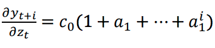

<font size = 2> Author: Chris Montgomery </br>
Last Revised: 11/4/2018 </font> 
</br>
</br>
<font face = "bold", size = 6>Part I </font>

The below code chunk creates the necessary inputs for the below intervention equation:

<font face = "italic", size = 3.5> Xt= a0 +a1(t-1) +c0*Zt +Wt </font> <font size = 2>(1) </font>

where: </br>
Xt = output at time t </br>
Z = an intervention dummy </br>
Wt = white noise forcing process </br>
a0; a1 = assumed coefficient values </br>

```{r , include=FALSE}
library(dplyr)
```
```{R}
set.seed(3)
x <- w <- rnorm(1:100)
c0 <- 4
z <- c(rep(0,100)) ; z [10:11] <- 1 
a1 <- .75
a0 <- 0

```

</br>


```{R}
for(t in 2:100){
  x[t] <- a0 + a1*x[t-1] + c0*(z[t]) + w[t]
}

plot(as.ts(x), ylab = "X[t]", main = "Simulation: White Noise Series with White Noise Intevention at t = 11,12")

```

</br> Simulating the series yields the above plot. The visual clearly depicts a short run spike at observations 10 and 11, associated with the introduction of the intervention. Following the intervention, the series appears to converge to mean 0. This should be fairly intuitive, as the simulation assigns a a1 parameter that is less than 1. </br>

The below code solves for the Impulse Response function (IRF) of the intervention equation. At each time period, the IRF the IRF reports the effect of the ongoing intervention (if the intervention is still occuring) as well as the effects on Xt associated with the intervention occuring in previous observations. Equation 2 depicts the IRF solution for a continuous intervention at a time that is i observations away from the beginning of the intervention. However, given the specifications of the above simulation, the intervention is non-continuous and thus non-permanent. Equation 3 can be used to solve for the IRF at any time t.  </br>

  (2) </br>
 (3) </br>


```{r}
#create an empty vector to house our impulse values 

irf <- c()

# Creates a loop that solves the IRF summation equation for each point in time from 1:100
for (i in 2:100){
  j <- i - 1
  irf[i] <- sum( c0 * z[i:1] * a1^(0:j))
}
plot(irf, main = "Impulse Response Function", xlab = "Time", ylab = "IRF[t]", type = "l")

```
</br> 

Plotting the IRF function elucidates the temprorary nature of the intervention. Here we see that the IRF spikes beginning at observation 10, reaching its maximum at observation 11. At subsequent observations, the intervention dummy is turned off, and the IRF converges to zero as time increases. As such, the long run convergence of the IRF to 0 shows that, in the limit, the mean of the intervention equation remains unchanged due to the intervention. In theory, the IRF of a permanent intervention would converge to a long of 16, as denoted by the below long run IRF equation: </br>

  $$Long Run IRF =  \frac{c0}{1-a1} $$
  $$ 16 = \frac {4}{1-.75}$$
with c0 = 4 representing the initial effect of the intervention. Fitting an OLS regression does reasonably well in approximating both the initial effect of the intervention (c0 = 4.3), and the theorized long run IRF value (17.3). This is particularly impressive considering the fact that the intervention occured over only 2 periods.   
  
```{r}
fit <- lm (x~ lag(x)+ z )
fit

#short run effect is just the z parameter. Long run effect is equal to 11.42 according to the model fit
#it should actually converge to 10 if left on forever

fit$coefficients[3] / (1 - a1)
``` 

</br>
<font size =6, face = "bold"> Part II </font> </br>

The below code simulates a time series that is dictated by a time trend and stochastic term.  

```{r}
x <- w <- rnorm(100)
a0 <- 0 
a1 <- .1
time <- c()
for (t in 1:100){
  time[t] <- t
  x[t] <- a0 + a1*t + w[t]
}

plot(x, type = "l", main = "X[t] = a0 + a1*t + w[t]", xlab = "Time")
```
</br>

Knowing the data generating process allows us to determine which transformation is most appropriate for making the above series stationary. Given the existance of a time trend, and no AR terms, subtracting the residuals of an OLS model forom the series will yield the least amount of white noise in the transformed series. This should be fairly intuitive, as the detrending method effectively removes the a0 constant and t parameter from the equation. Thus, the detrended value of X at all t is simply a current white noise term. Taking the first difference, a suboptimal alternative transformation, introduces additional noise due to the presence of a lagged white noise term. Consider the first difference transformation:  </br>

$$X_t = a0 + a1*t + w_t $$ 
$$X_{t-1} = a0 + a1*(t - 1) + w_t -  w_{t-1}  $$

$$ X_t - X{t-1} = a1 + w_t - w_{t-1} $$ 

</br>

The below code further elucidates the fact that detrending is a more appropriate stationary transformation for this simulation. The sum of square errors is lower for the detrended series, indicating the presence of less noise compared to the differenced series. At the same time, the ACF function of the differenced series shows a highly significant first lag. This makes sense as the first difference transformation effectively converts the series to a moving averge process.

```{r}
#First difference

diff.x <- diff(as.ts(x))
# plot(diff.x)
# mean(diff.x)


detrend <- lm(x~ time)
detrend.x <- x - detrend$fitted.values


# plot(as.ts(detrend.x))
# mean(detrend.x)

ssr.diff <- sum((diff.x - mean(diff.x))^2); ssr.diff
ssr.detrend <- sum ((detrend.x - mean(detrend.x))^2 ); ssr.detrend

acf(as.ts(diff.x), xlab = "First Difference Series ACF")
acf(as.ts(detrend.x), xlab = "Detrended Series ACF ")

```


<font size= 6, face = "bold"> Part III </font>

Visual Inspection of the below stock exchanges suggest positive covariance and the presence of a positive drift parameter over time.

```{r}
#PART III

#Read in our data and plot our series 
df <- read.delim("stockmarket.dat", sep = "")
df.ts <- as.ts(df)


#layout(1:2)
#par(mar=c(1,1,1,1))
plot(df$NewYork, xlab = "New York Exchange", type = "l")
plot(df$London, xlab = "London Exchange", type = "l")


```

For both series, ACF, PACF, Augmented Dickey Fuller, and Phillips-Perron tests suggest that a unit root is present. As such, neither series can be considered stationary. 

```{r}
#ACF/PACF Plots suggest non-stationarity
#ADF Tests and PP tests suggest the presence of no unit root in the NY series, but not the London series

library("tseries")

layout(1:2)
acf(df.ts[,7], xlab = "NY Stock ACF") ; pacf(df.ts[,7], xlab = "NY Stocl PACF"); 
adf.test(df.ts[,7]) ; PP.test(df.ts[,7])

layout(1:2)
acf(df.ts[,3], xlab = "London Stock ACF") ; pacf(df.ts[,3], xlab = "London Stock PACF") ; adf.test(df.ts[,3]); PP.test(df.ts[,3])
```

Fitting a VAR(1) model to the two series results in the below output. London stock values, denoted as x, appear to positively correlated with the first lag of the New York stock values, as shown by the positive y.l1 coefficient in the first VAR equation. As expected by the unit-root tests above, London stock values are positively correlated with its first lag, with a near 1 value for the lagged coefficient. </br>

New York stock exchange values appear to be weakly negatively correlated with the first lag of the London Stock Exchange. This is denoted by the -.0003 value for the x.l1 coefficient in the second VAR equation below. Like the London Exchange, the New York stock values are correlated with their first lag, with a near 1 coefficient value.  

```{R}
#VAR(1) Model

library("vars")
x <- df.ts[,3]; y<- df.ts[,7]

var1 <- VAR(cbind(x,y), p=1)
var1

```
</br>
Residual plots of the VAR model show more significant lags than expected at the 95% confidence level. This suggests that the VAR (1) model may not be the best fit. 

```{R}
acf(resid(var1)[, 1], xlab = "VAR(1): London VAR Residual ACF ")
acf(resid(var1)[, 2], xlab = "VAR(1): NY VAR Residual ACF")

```
</br>
The default VAR function in R selected a 12th order model as the optimal fit. This decision is supported by the lower AIC value associated with the VAR(12) fit. However, the residuals for the VAR(12) model appear to have significantly more auto-correlation thank expected at the 95% confidence interval. This raises uncertainty as to whether a VAR model is appropriate for the two series.   

```{R}
var.ar <- ar(cbind(x,y))
var.ar


acf(var.ar$res[-c(1:12), 1], xlab =  "VAR(12) London VAR Residual ACF")
acf(var.ar$res[-c(1:12), 2], xlab =  "VAR(12) NY VAR Residual ACF")


#AIC for both models suggest the VAR(12) model is a better fit
AIC(var1)
sum (var.ar$aic)

```


Repeating the above for the Frankfurt and Amsterdam stock series yields similar results. Like the NY and London stock series, the Frankfurt and  Amsterdam series appear to be non-stationary and characterized by a unit root. 

```{R}
layout(1:2)
plot(df$Frankfurt, main = "Frankfurt", type = "l", xlab = "Time")
plot(df$Amsterdam, main = "Amsterdam" , type = "l", xlab = "Time")


layout(1:2)
acf(df.ts[,1], xlab = "ACF Amsterdam Stock" ) ; pacf(df.ts[,1], xlab = "PACF Amsterdam Stock"); 
adf.test(df.ts[,1]) ; PP.test(df.ts[,1])
layout(1:2)
acf(df.ts[,2], xlab = "ACF Frankfurt Stock") ; pacf(df.ts[,2], xlab = "PACF Frankfurt Stock");
adf.test(df.ts[,2]); PP.test(df.ts[,2])

```

</br> 

For these two series, VAR(1) model suggests that the Amsterdam stock exchange is positively correlated with the first lag of the Frankfurt stock exchange. The Frankfurt exchange however, does not appear to be correlated with the first lag of the Amsterdam exchange. Residuals plots for both series show more greater than expected auto-correlation in lags, suggesting that VAR(1) might not be appropriate on the series without transformation. 

```{R}

y <- df.ts[,1]; x<- df.ts[,2]

var1 <- VAR(cbind(x,y), p=1)
var1


acf(resid(var1)[, 1], xlab = "ACF: VAR(1) Residuals Amsterdam Stock")
acf(resid(var1)[, 2], xlab= "ACF: VAR(1) Residuals Frankfurt Stock")

```
</br>
The residual plots for the VAR(12), the default choice for R's ar function, likewise show high degrees of auto-correlation. AIC values however suggest that the VAR(12) is a better fit for a VAR including Amsterdam and Frankfurt stock series. </br>

```{R}

var.ar <- ar(cbind(x,y))
var.ar
var.ar$ar

acf(var.ar$res[-c(1:12), 1], main = "ACF: VAR(12) Residuals Amsterdam Stock")
acf(var.ar$res[-c(1:12), 2], main = "ACF: VAR(12) Residuals Frankfurt Stock")

AIC(var1)
sum (var.ar$aic)

